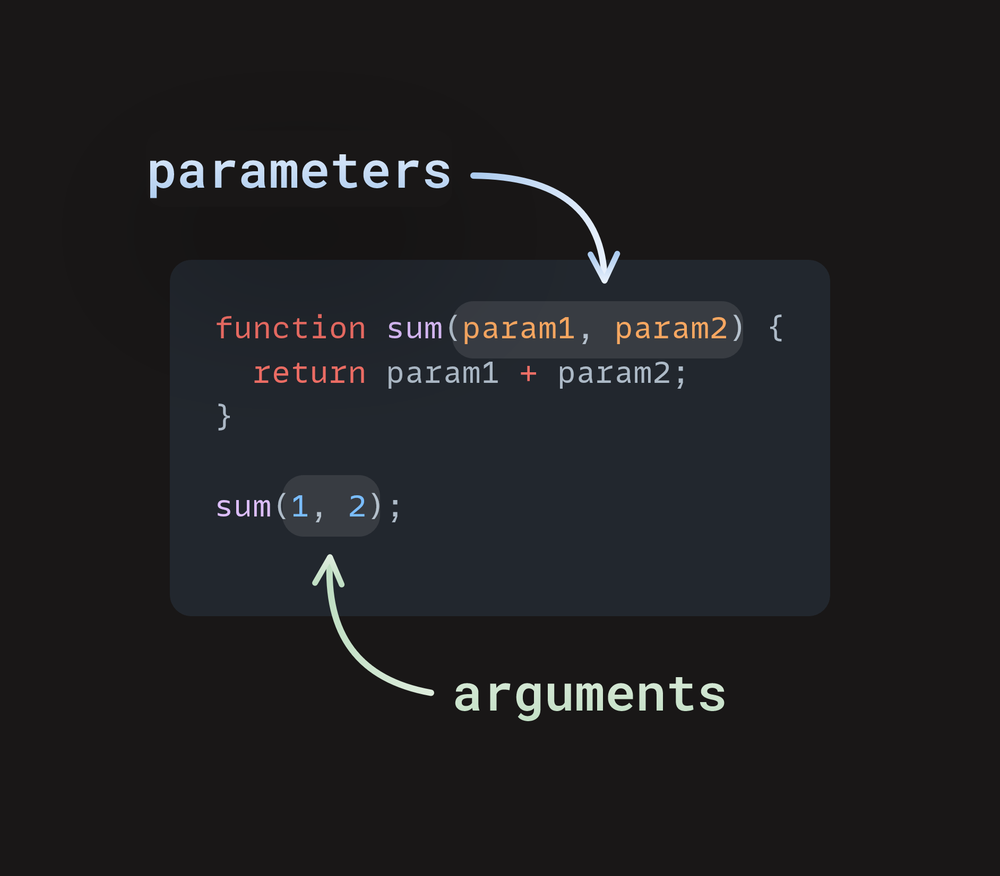

# Curriculum of curricula

## Goal
1. briefly describe the curricula available
1. identify the links and download/configure for local use.
1. offer advice based on skill levels.
1. offer a timeline for learning
1. point to exercises, quizzes, project of various levels of complexity

## Constraints
1. Four quarters
1. quarter 1: HTML/CSS basics with graphic design
1. quarter 2: intro to javascript and tools of the trade
1. quarter 3: backend: express, astro, tailwindcss, pocketbase, mongo
1. quarter 4: react, react-router

## Offline Web Sites
1. [w3schools](https://www.w3schools.com)
1. [MDN](https://developer.mozilla.com)
1. [odin project](https://odin-project.com)
1. others

## Reviews

### Odin Projetc
The design is old school. It explains in detail the mechanics of HTML/CSS/JS with emphasis in getting deep but the web design's responsivness is left somewhere in the middle after exhaustive explanation of the basics of HTML/CSS. It provides a lot of external resources as 'additions' to the main topics. Some are very good, some are very detailed (not good for beginners, who are still unsure about this path).

#### Foundations
1. Introduction
    1. How This Course Will Work
    1. Introduction to Web Development
    1. Motivation and Mindset
    1. Asking For Help
    1. Join the Odin Community
1. Prerequisites
    1. Computer Basics
    1. How Does the Web Work?
    1. Installation Overview
    1. Installations
    1. Text Editors
    1. Command Line Basics
    1. Setting up Git
1. next

##### Odin Introduction

1. The curriculum based on "aggregations of the best content" from across the internet.
1. Q&A at the end of each chapter
1. Practice projects provided
1. It is not a class when you learn and then you either 'pass' or 'fail'
1. It is a snowball: you roll and the ball grows. Sometimes snow would fall off (you forget). 
1. **IT IS NOT A TEST OF WHAT 'YOU HAVE MEMORIZED SO FAR'**
1. The skills you learn are transferable to other contexts.
1. The Odin Project is maintained by professionals
1. Additional resources are optional, only if you want to dive deeper.

##### Introduction: Motivation and Mindset 

1. Learning to code is rewarding but can also be frustrating.
1. Growth mindset
1. The learning process: focused/diffuse mode
1. What to do when you're stuck: google it, take a break, ask for help follow the diagram.
1. 
1. A note on AI code generation: "potentially negative impact on core learning"
1. Managing your study times: be consistent, "Don't worry, just learn!"
1. Pitfalls to avoid: a. procrastination the biggest enemy!! => follow the "**Pomodoro technique**", b. not taking breaks => solution: take breaks (listen to music, write a journal, doodle, meditate, play a quick game, go for a short walk), c. digital distractions => turn off notifications, d. physical distractions => go to a quiet place, e. rabbit holes: trying to learn all there is to know about a subject => stick a defined path, no sidetrack, no jumping, no rushing, f. comparing yourself to others => compare yourself "only to your past self", g. counterproductive note-taking => "make notes as prompts for further research" and get "comfortable with reading documentation" 
1. [FAQ](https://www.theodinproject.com/faq)
1. [Motivation and Mindset](https://www.theodinproject.com/lessons/foundations-motivation-and-mindset)

##### Introduction: Asking For Help
1. Difference between a "good vs bad question"
1. How to write a "well-formed question"
1. Instead of "How do I complete Step 5 of the Rock Paper Scissors Assignment"?
1. A better question:
1. "Hey, I'm trying to return a string that displays the winner in Rock Paper Scissors, but I'm getting a syntax error on line 12. How can I fix this? Here's my code."
1. [don't ask to ask](https://dontasktoask.com/)
1. [XY Problem](https://xyproblem.info/)
1. [how to ask](https://www.theodinproject.com/guides/community/how_to_ask)
1. [pseudocode](https://www.theodinproject.com/lessons/foundations-problem-solving)
1. Importance of documenting the whole process of thinking, formulating, asking the question in a README.md file
1. [be great at asking questions](https://medium.com/@gordon_zhu/how-to-be-great-at-asking-questions-e37be04d0603)
1. [stackoverflow how to](https://stackoverflow.com/help/how-to-ask)
1. [how to use google](https://old.codinginflow.com/google-programming-questions)
1. [Do not answer a question, be the guide](https://www.theodinproject.com/lessons/foundations-join-the-odin-community)

##### Prerequisites

##### Prerequisites: Computer Basics

1. [offline gcf](https://edu.gcfglobal.org/en/download/all/)
1. [What is a computer?](https://edu.gcfglobal.org/en/computerbasics/what-is-a-computer/1/)
1. [What is an operating system?](https://edu.gcfglobal.org/en/computerbasics/understanding-operating-systems/1/)
1. [What is an application?](https://edu.gcfglobal.org/en/computerbasics/understanding-applications/1/)
1. [Open source vs closed source software.](https://edu.gcfglobal.org/en/basic-computer-skills/open-source-vs-closed-source-software/1/)
1. [Taking screenshots.]()

##### Prerequisites: How Does the Web Work?

<ol>
      <li>Watch this BBC short for an <a href="https://www.youtube.com/watch?v=eHp1l73ztB8" target="_blank" rel="noopener noreferrer">overview of how the internet works</a>.</li>
      <li>Read this <a href="http://localhost:22022/Public/Download/2025/mdn2025/developer.mozilla.org/en-US/Learn/Common_questions/How_does_the_Internet_work" target="_blank" rel="noopener noreferrer">Mozilla article on “How does the internet work?”</a>.</li>
      <li>Watch <a href="https://youtu.be/7_LPdttKXPc?t=46s" target="_blank" rel="noopener noreferrer">How the Internet Works in 5 Minutes</a>.</li>
      <li>Read up on the <a href="http://localhost:22022/Public/Download/2025/mdn2025/developer.mozilla.org/en-US/Learn/Common_questions/Pages_sites_servers_and_search_engines" target="_blank" rel="noopener noreferrer">differences between a web page, a web server, and a search engine</a>.</li>
      <li>Watch this <a href="https://youtu.be/BrXPcaRlBqo" target="_blank" rel="noopener noreferrer">Google short explaining what a web browser is</a>. Then, use this site to <a href="https://www.whatsmybrowser.org/" target="_blank" rel="noopener noreferrer">find out your current web browser and version</a>.</li>
      <li>Read about <a href="http://localhost:22022/Public/Download/2025/mdn2025/developer.mozilla.org/en-US/Learn/Getting_started_with_the_web/How_the_Web_works#Clients_and_servers" target="_blank" rel="noopener noreferrer">how different parts of the web interact with each other</a> and read this <a href="http://localhost:22022/Public/Download/2025/mdn2025/developer.mozilla.org/en-US/docs/Learn/Common_questions/Web_mechanics/What_is_a_domain_name#how_does_a_dns_request_work" target="_blank" rel="noopener noreferrer">MDN article about how a DNS request works</a>. Alternatively, here is a <a href="https://www.youtube.com/watch?v=72snZctFFtA&amp;t=45s" target="_blank" rel="noopener noreferrer">video about how a DNS request works</a>.</li>
    </ol>

<ul>
    <li><a href="http://localhost:22022/Public/Download/2025/mdn2025/developer.mozilla.org/en-US/docs/Learn/Common_questions/Pages_sites_servers_and_search_engines" target="_blank" rel="noopener noreferrer">What is a web server?</a></li>
    <li><a href="http://localhost:22022/Public/Download/2025/mdn2025/developer.mozilla.org/en-US/docs/Learn/Common_questions/How_does_the_Internet_work" target="_blank" rel="noopener noreferrer">What is a network?</a></li>
    <li><a href="https://www.youtube.com/watch?v=7_LPdttKXPc&amp;t=46s" target="_blank" rel="noopener noreferrer">What is the internet?</a></li>
    <li><a href="http://localhost:22022/Public/Download/2025/mdn2025/developer.mozilla.org/en-US/docs/Learn/Common_questions/How_does_the_Internet_work" target="_blank" rel="noopener noreferrer">What is an IP address?</a></li>
    <li><a href="http://localhost:22022/Public/Download/2025/mdn2025/developer.mozilla.org/en-US/docs/Learn/Common_questions/How_does_the_Internet_work" target="_blank" rel="noopener noreferrer">What is a router?</a></li>
    <li><a href="http://localhost:22022/Public/Download/2025/mdn2025/developer.mozilla.org/en-US/docs/Learn/Common_questions/How_does_the_Internet_work" target="_blank" rel="noopener noreferrer">What is an ISP?</a></li>
    <li><a href="http://localhost:22022/Public/Download/2025/mdn2025/developer.mozilla.org/en-US/docs/Learn/Getting_started_with_the_web/How_the_Web_works#packets_explained" target="_blank" rel="noopener noreferrer">What are packets and how are they used to transfer data?</a></li>
    <li><a href="http://localhost:22022/Public/Download/2025/mdn2025/developer.mozilla.org/en-US/docs/Learn/Getting_started_with_the_web/How_the_Web_works#clients_and_servers" target="_blank" rel="noopener noreferrer">What is a client?</a></li>
    <li><a href="http://localhost:22022/Public/Download/2025/mdn2025/developer.mozilla.org/en-US/docs/Learn/Getting_started_with_the_web/How_the_Web_works#clients_and_servers" target="_blank" rel="noopener noreferrer">What is a server?</a></li>
    <li><a href="http://localhost:22022/Public/Download/2025/mdn2025/developer.mozilla.org/en-US/docs/Learn/Common_questions/Pages_sites_servers_and_search_engines" target="_blank" rel="noopener noreferrer">What is a web page?</a></li>
    <li><a href="https://www.youtube.com/watch?v=BrXPcaRlBqo&amp;feature=youtu.be" target="_blank" rel="noopener noreferrer">What is a web browser?</a></li>
    <li><a href="http://localhost:22022/Public/Download/2025/mdn2025/developer.mozilla.org/en-US/docs/Learn/Common_questions/Pages_sites_servers_and_search_engines" target="_blank" rel="noopener noreferrer">What is a search engine?</a></li>
    <li><a href="https://www.youtube.com/watch?v=72snZctFFtA&amp;t=45s" target="_blank" rel="noopener noreferrer">What is a DNS request?</a></li>
    <li><a href="https://www.whatsmybrowser.org/" target="_blank" rel="noopener noreferrer">Which browser are you currently using?</a></li>
    <li><a href="http://localhost:22022/Public/Download/2025/mdn2025/developer.mozilla.org/en-US/docs/Learn/Common_questions/Pages_sites_servers_and_search_engines" target="_blank" rel="noopener noreferrer">In your own words, describe the process that takes place when you initiate a search on google.com in terms of what we discussed.</a></li>
  </ul>

  Some advice on reading: We recommend that you only review the immediate links posted in our curriculum. You can always go deeper on any subject if you wish, but be careful not to overload yourself on information!

  forms 
  <ol>
      <li>Read and follow along with <a href="http://localhost:22022/Public/Download/2025/mdn2025/developer.mozilla.org/en-US/docs/Learn/Forms#introductory_guides" target="_blank" rel="noopener noreferrer">MDN’s Introductory Guides to Forms</a> - complete <a href="http://localhost:22022/Public/Download/2025/mdn2025/developer.mozilla.org/en-US/docs/Learn/Forms/Your_first_form" target="_blank" rel="noopener noreferrer">Your first form</a> and <a href="http://localhost:22022/Public/Download/2025/mdn2025/developer.mozilla.org/en-US/docs/Learn/Forms/How_to_structure_a_web_form" target="_blank" rel="noopener noreferrer">How to structure a web form</a></li>
      <li>Read and follow along with <a href="http://localhost:22022/Public/Download/2025/mdn2025/developer.mozilla.org/en-US/docs/Learn/Forms#the_different_form_controls" target="_blank" rel="noopener noreferrer">MDN’s The Different Form Controls Guides</a></li>
    </ol>

    <li><a href="https://web.dev/learn/forms/" target="_blank" rel="noopener noreferrer">Web.dev’s Form Course</a></li>

    http://localhost:22022/Public/Download/2025/mdn2025/developer.mozilla.org/en-US/docs/Learn/Forms/Form_validation

    http://localhost:22022/Public/Download/2025/mdn2025/developer.mozilla.org/en-US/docs/Web/JavaScript/Guide/Regular_expressions/Cheatsheet

    http://localhost:22022/Public/Download/2025/mdn2025/developer.mozilla.org/en-US/docs/Learn/JavaScript/First_steps/What_is_JavaScript

Odin Project JS data types conditionals
    <ul>
    <li><a href="https://javascript.info/types#summary" target="_blank" rel="noopener noreferrer">What are the eight data types in JavaScript?</a></li>
    <li><a href="https://javascript.info/types#objects-and-symbols" target="_blank" rel="noopener noreferrer">Which data type is NOT primitive?</a></li>
    <li><a href="https://javascript.info/types#the-null-value" target="_blank" rel="noopener noreferrer">What is the relationship between null and undefined?</a></li>
    <li><a href="http://localhost:22022/Public/Download/2025/mdn2025/developer.mozilla.org/en-US/docs/Learn/JavaScript/First_steps/Strings#single_quotes_double_quotes_and_backticks" target="_blank" rel="noopener noreferrer">What is the difference between single, double, and backtick quotes for strings?</a></li>
    <li><a href="http://localhost:22022/Public/Download/2025/mdn2025/developer.mozilla.org/en-US/docs/Learn/JavaScript/First_steps/Strings#embedding_javascript" target="_blank" rel="noopener noreferrer">What is the term for joining strings together?</a></li>
    <li><a href="http://localhost:22022/Public/Download/2025/mdn2025/developer.mozilla.org/en-US/docs/Learn/JavaScript/First_steps/Strings#embedding_javascript" target="_blank" rel="noopener noreferrer">Which type of quote lets you embed variables/expressions in a string?</a></li>
    <li><a href="http://localhost:22022/Public/Download/2025/mdn2025/developer.mozilla.org/en-US/docs/Learn/JavaScript/First_steps/Strings#embedding_javascript" target="_blank" rel="noopener noreferrer">How do you embed variables/expressions in a string?</a></li>
    <li><a href="http://localhost:22022/Public/Download/2025/mdn2025/developer.mozilla.org/en-US/docs/Learn/JavaScript/First_steps/Strings#including_quotes_in_strings" target="_blank" rel="noopener noreferrer">How do you use escape characters in a string?</a></li>
    <li><a href="https://www.w3schools.com/js/js_string_methods.asp" target="_blank" rel="noopener noreferrer">What is the difference between the slice/substring string methods?</a></li>
    <li><a href="http://javascript.info/logical-operators" target="_blank" rel="noopener noreferrer">What are the three logical operators, and what do they stand for?</a></li>
    <li><a href="https://javascript.info/comparison" target="_blank" rel="noopener noreferrer">What are the comparison operators?</a></li>
    <li><a href="https://javascript.info/ifelse#boolean-conversion" target="_blank" rel="noopener noreferrer">What are truthy and falsy values?</a></li>
    <li><a href="https://javascript.info/ifelse#boolean-conversion" target="_blank" rel="noopener noreferrer">What are the falsy values in JavaScript?</a></li>
    <li><a href="https://www.w3schools.com/js/js_if_else.asp" target="_blank" rel="noopener noreferrer">What are conditionals?</a></li>
    <li><a href="http://localhost:22022/Public/Download/2025/mdn2025/developer.mozilla.org/en-US/docs/Learn/JavaScript/Building_blocks/conditionals#basic_if...else_syntax" target="_blank" rel="noopener noreferrer">What is the syntax for an if/else conditional?</a></li>
    <li><a href="http://localhost:22022/Public/Download/2025/mdn2025/developer.mozilla.org/en-US/docs/Learn/JavaScript/Building_blocks/conditionals#switch_statements" target="_blank" rel="noopener noreferrer">What is the syntax for a switch statement?</a></li>
    <li><a href="http://localhost:22022/Public/Download/2025/mdn2025/developer.mozilla.org/en-US/docs/Learn/JavaScript/Building_blocks/conditionals#ternary_operator" target="_blank" rel="noopener noreferrer">What is the syntax for a ternary operator?</a></li>
    <li><a href="http://localhost:22022/Public/Download/2025/mdn2025/developer.mozilla.org/en-US/docs/Learn/JavaScript/Building_blocks/conditionals#nesting_if...else" target="_blank" rel="noopener noreferrer">What is nesting?</a></li>
  </ul>

  https://developer.chrome.com/docs/devtools/javascript/

foundations-function-basics
  

  http://localhost:22022/Public/Download/2025/mdn2025/developer.mozilla.org/en-US/docs/Learn/JavaScript/Building_blocks/Functions

  http://localhost:22022/Public/Download/2025/mdn2025/developer.mozilla.org/en-US/docs/Learn/JavaScript/Building_blocks/Return_values

  http://localhost:22022/Public/Download/2025/mdn2025/developer.mozilla.org/en-US/docs/Learn/JavaScript/Building_blocks/Functions#function_scope_and_conflicts

  https://www.theodinproject.com/lessons/foundations-problem-solving

  fizzbuzz with pseudocode

  https://www.theodinproject.com/lessons/foundations-understanding-errors

  http://localhost:22022/Public/Download/2025/mdn2025/developer.mozilla.org/en-US/docs/Web/JavaScript/Reference/Global_Objects/ReferenceError

  http://localhost:22022/Public/Download/2025/mdn2025/developer.mozilla.org/en-US/docs/Web/JavaScript/Reference/Global_Objects/SyntaxError

  http://localhost:22022/Public/Download/2025/mdn2025/developer.mozilla.org/en-US/docs/Web/JavaScript/Reference/Global_Objects/SyntaxError

  http://localhost:22022/Public/Download/2025/mdn2025/developer.mozilla.org/en-US/docs/Learn/JavaScript/First_steps/What_went_wrong

  http://localhost:22022/Public/Download/2025/mdn2025/developer.mozilla.org/en-US/docs/Web/JavaScript/Reference/Errors

  https://www.w3schools.com/jsref/obj_console.asp

  https://www.theodinproject.com/lessons/foundations-rock-paper-scissors

  https://www.theodinproject.com/lessons/foundations-rock-paper-scissors

  https://github.com/airbnb/javascript

  https://github.com/TheOdinProject/javascript-exercises#readme

  